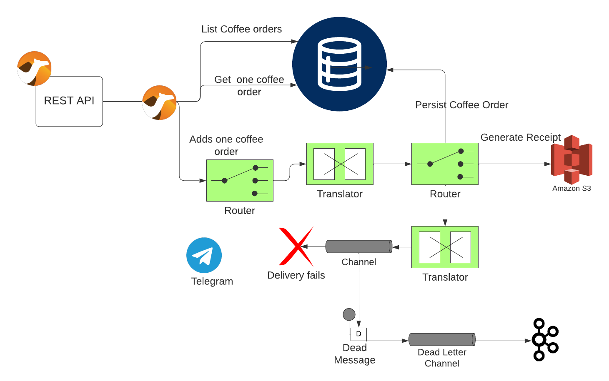

# Connecting Disparate Systems in a Lightweight Way

This repository contains a demo for a talk on connecting disparate systems in a lightweight way.

**Prerequisites:**

- Java 17+ JVM
- Docker or an equivalent containerization tool (e.g., podman)
- _Optional_ Credentials for an AWS S3 bucket and a Telegram chatbot, along with your chat ID
- _Optional_ Postgresql database and Kafka


_Figure 1: High-level architecture of the demo_

To run the demo in development mode, follow these steps:

```bash
$ ./mvnw compile quarkus:dev
```

Running in development mode will automatically provision the Postgresql database and Kafka broker. If you lack credentials for AWS S3 or Telegram, any errors will be captured in the Kafka topic.